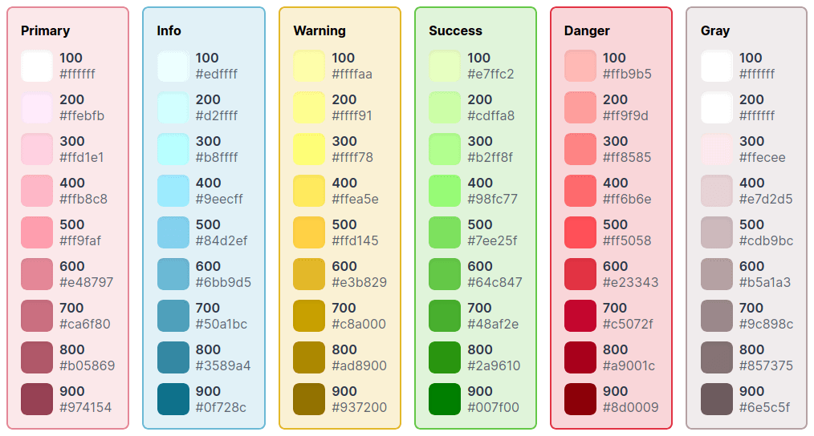

# Tailwind Color Generator

Yet another [Tailwind](https://tailwindcss.com/) color palette generator.



## Inspiration

- [Color Scheme Generator](https://adevade.github.io/color-scheme-generator/)
- [Color Shades Generator](https://javisperez.github.io/tailwindcolorshades/#/)
- [Tint and Shade Generator](https://maketintsandshades.com/)

The main inspiration was from color scheme generator, but it doesn't provide 100 - 900 shadings.
Color shades generator however did, but doesn't provide a nice palette out of the box.
Combined, becomes this project.

Tint and shade generator has a nice formula to lighten/darken colors which will be supported in this project.

## Todo

- Color hex casings
- Website theme
- Set base theme colors (success, warning, etc...)
- More base themes
- Share link
- Custom lighten/darken intensity and formula
- Tint and shade lighten/darken formula
- Color picker

## Development

``` bash
# Project setup
yarn install

# Compiles and hot-reloads for development
yarn serve

# Compiles and minifies for production
yarn build

# Lints and fixes files
yarn lint
```

## License

MIT
